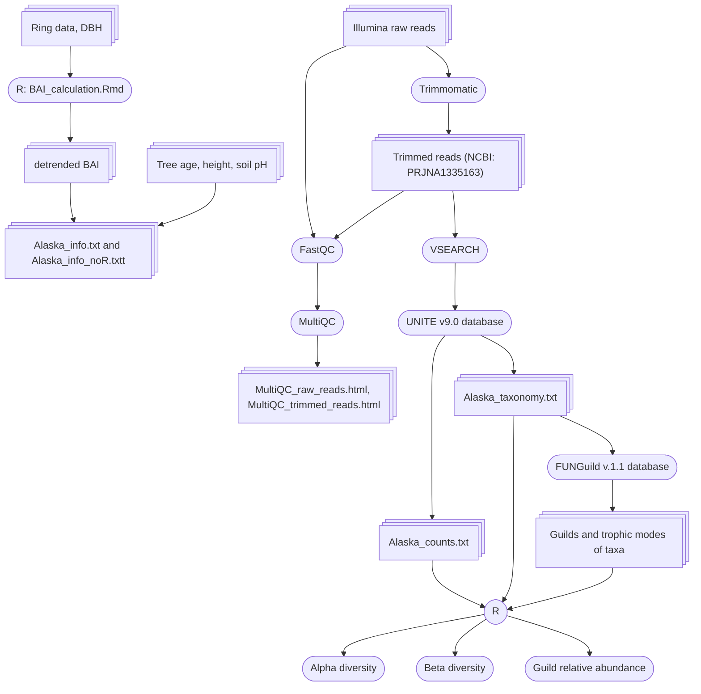

# _Picea_ _glauca_ metabarcoding vs growth
A study examining the connection between root-associated fungi and the growth performance of _Picea glauca_.

> [!TIP]
> To view any HTML file, please download it

## Workflow:

